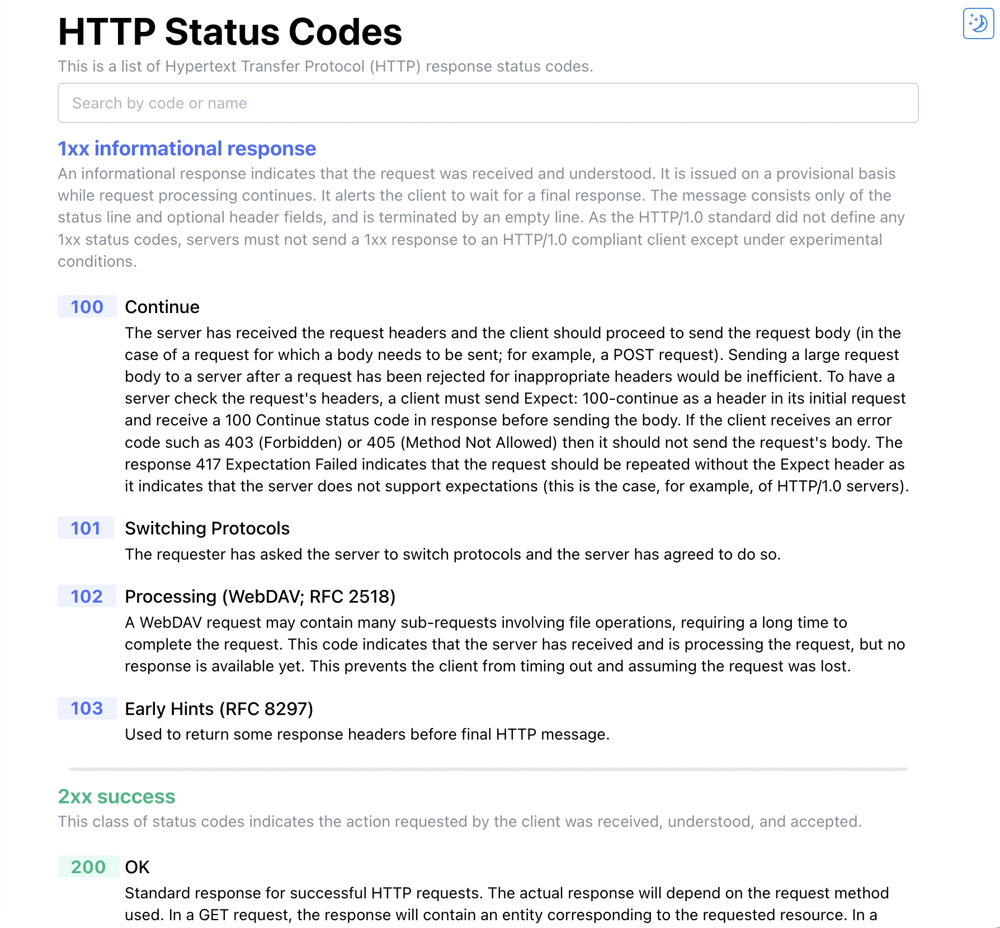
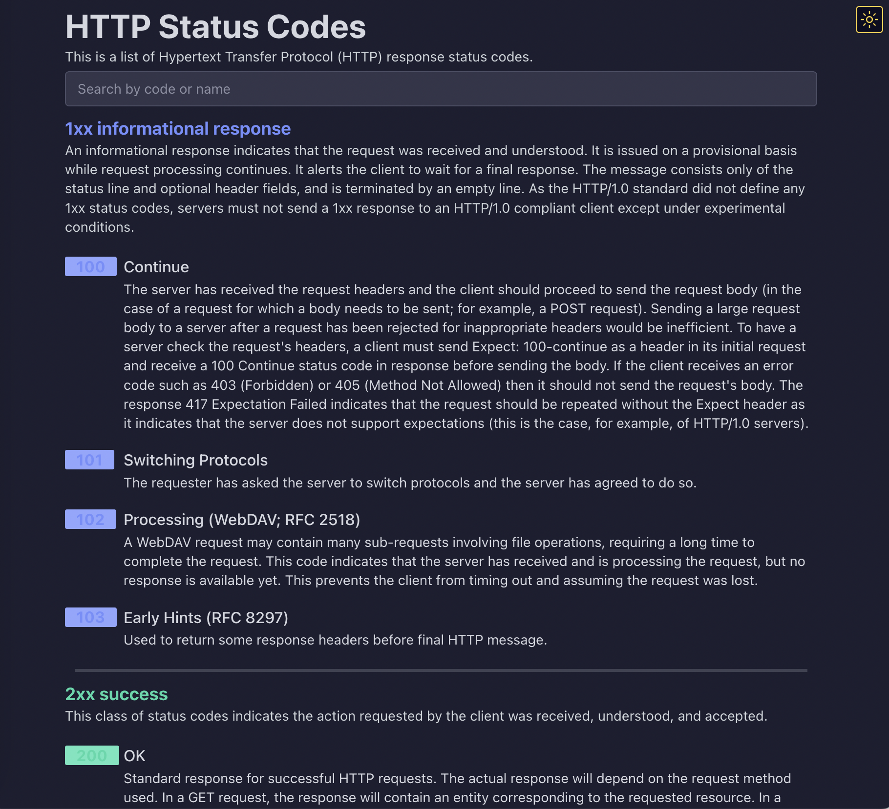
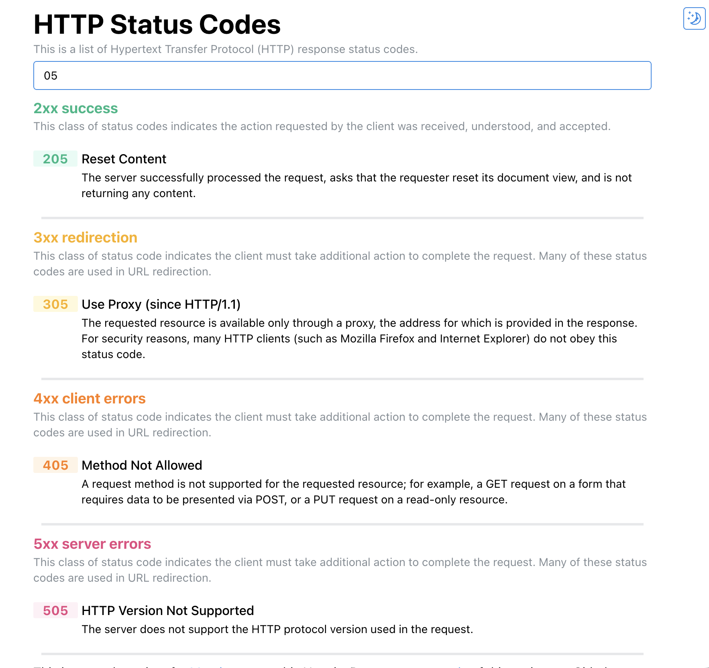

# Mantine + Next.js

This repository is an example integration [mantine](https://mantine.dev) and [Next.js](https://nextjs.org/).

## Features

- [Typescript](http://www.typescriptlang.org/)
- [Dark theme](https://mantine.dev/guides/dark-theme/)

### Light theme



### Dark theme



### Search



This is a [Next.js](https://nextjs.org/) project bootstrapped with [`create-next-app`](https://github.com/vercel/next.js/tree/canary/packages/create-next-app).

### Getting Started

First, run the development server:

```bash
npm run dev
# or
yarn dev
```

Open [http://localhost:3000](http://localhost:3000) with your browser to see the result.
